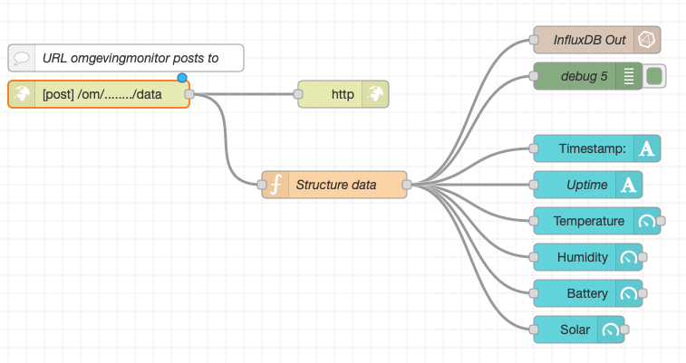
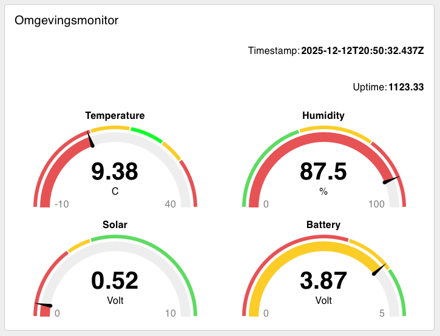

# NodeRed_Omgevingsmonitor
NodeRed flow to capture Omgevingsmonitor data to InfluxDB, for visualisation using Grafana.
Realtime values are also displayed in a NodeRed dashboard.

The Omgevingsmonitor is the 2024 trade show gadget of the Dutch technology fair, World of Technology and Science.

More information: [https://www.agri-vision.nl/portal/projects/32-modifications-to-the-wots-2024-omgevingsmonitor][def]

Flow:

Dashboard:

[def]: https://www.agri-vision.nl/portal/projects/32-modifications-to-the-wots-2024-omgevingsmonitor